<div align="center">

# GastApp

### Aplicación web para administración de finanzas personales y grupales


</div>

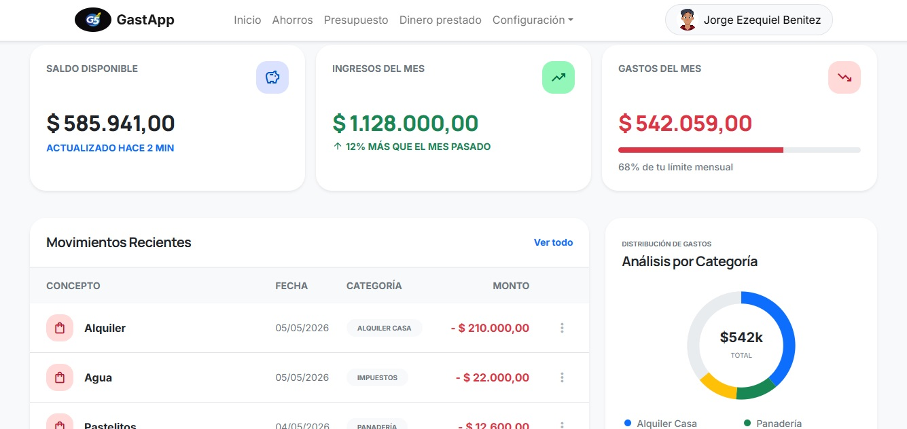

---

## Tabla de contenidos

- [Acerca del proyecto](#acerca-del-proyecto)
- [Funcionalidades destacadas](#funcionalidades-destacadas)
- [Capturas](#capturas)
- [Stack tecnológico](#stack-tecnológico)
- [Arquitectura](#arquitectura)
- [Modelo de datos](#modelo-de-datos)
- [Instalación y puesta en marcha](#instalación-y-puesta-en-marcha)
- [Equipo](#equipo)
- [Acerca del proyecto académico](#acerca-del-proyecto-académico)

---

## Acerca del proyecto

**GastApp** es una aplicación web multi-usuario para administrar finanzas personales y compartidas. Permite registrar movimientos, definir presupuestos por categoría, fijar metas de ahorro y llevar el control de préstamos con cuotas, todo dentro del concepto de **Hogar** que permite a varios integrantes compartir gastos.

Fue desarrollada como **Proyecto Integrador Final** de la materia Programación IV de la Tecnicatura Universitaria en Programación de la **UTN FRGP**, por un equipo de 5 personas.

---

## Funcionalidades destacadas

### Multi-usuario con "Hogares" compartidos
Los usuarios pueden pertenecer a uno o más **Hogares**, cada uno con sus propios integrantes y gastos compartidos. El sistema implementa **roles diferenciados** dentro de cada hogar:
- **Administrador**: gestiona el hogar y sus miembros.
- **Miembro**: registra y consulta movimientos.
- **Lector**: solo consulta.

### Dashboard con KPIs y gráficos
- Saldo disponible, ingresos y gastos del mes, todo en un vistazo.
- **Gráfico de torta** con la distribución de gastos por categoría.
- Indicadores de tendencia mes a mes (ej. *“12% más que el mes pasado”*).
- Barra de progreso del límite mensual.

### Historial de movimientos con filtros
- Listado cronológico agrupado por día.
- Filtros combinables por **período**, **tipo de operación**, **categoría** y **medio de pago**.

### Presupuestos por categoría
- Definir un presupuesto mensual por categoría con seguimiento del % consumido vs presupuestado.
- Navegación mes a mes para revisar la evolución.

### Metas de ahorro
- Crear metas con **fecha objetivo** y **monto a alcanzar**.
- Registrar aportes parciales con seguimiento del progreso (barra %).

### Sistema de préstamos con cuotas
- Registrar **dinero prestado** con cuotas y vencimientos.
- Estados de cobro (**Cobrada / Pendiente**) con acción rápida de cobro.
- KPIs globales: total prestado, total pendiente, cantidad de deudores.

### Autenticación y seguridad
- Registro y login de usuarios.
- **Recuperación de contraseña por email** (flujo completo: solicitud → mail → restablecimiento).
- Modificación de perfil y contraseña.

### Diseño responsive
- Interfaz adaptable a móvil con `Site.Mobile.Master`.

---

## Capturas

### Login

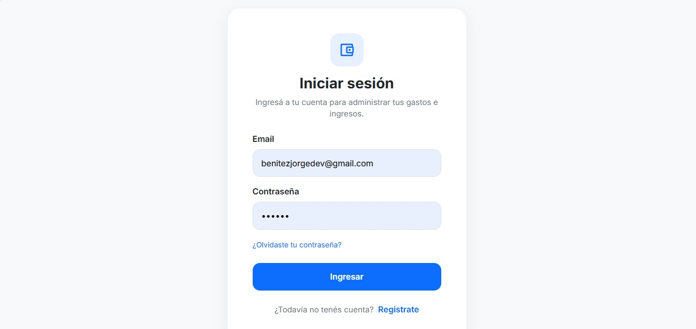

### Dashboard principal


### Historial de movimientos con filtros

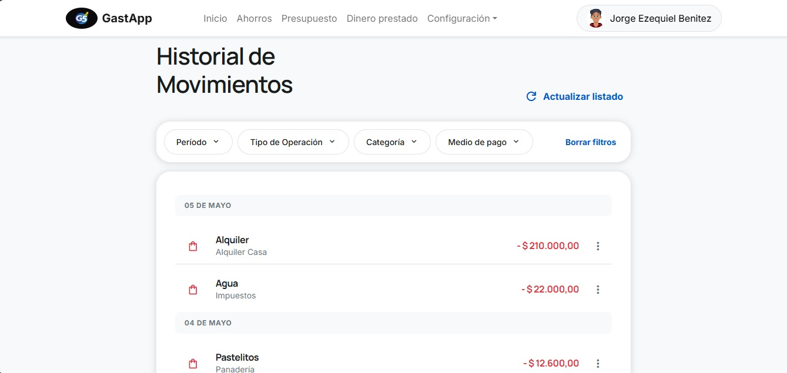

### Vista de Hogar compartido

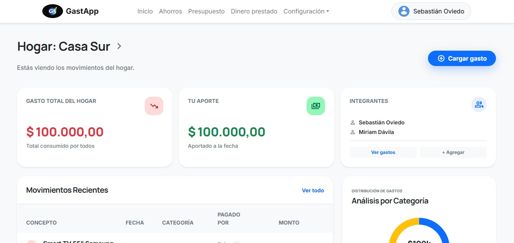

### Gastos por integrante

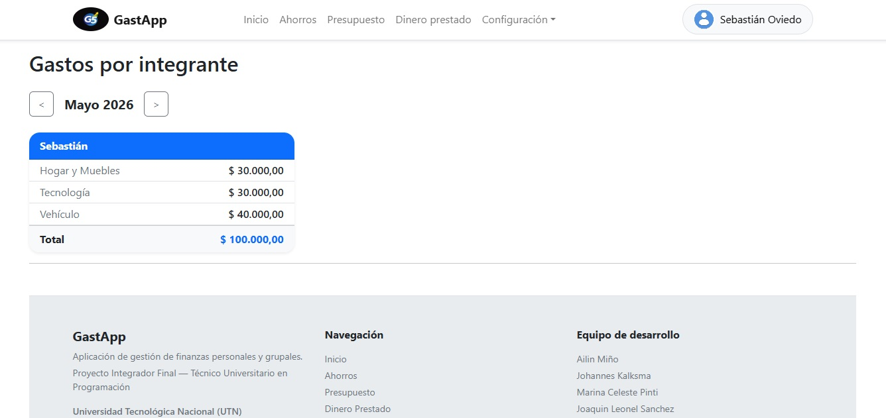

### Presupuesto mensual por categoría

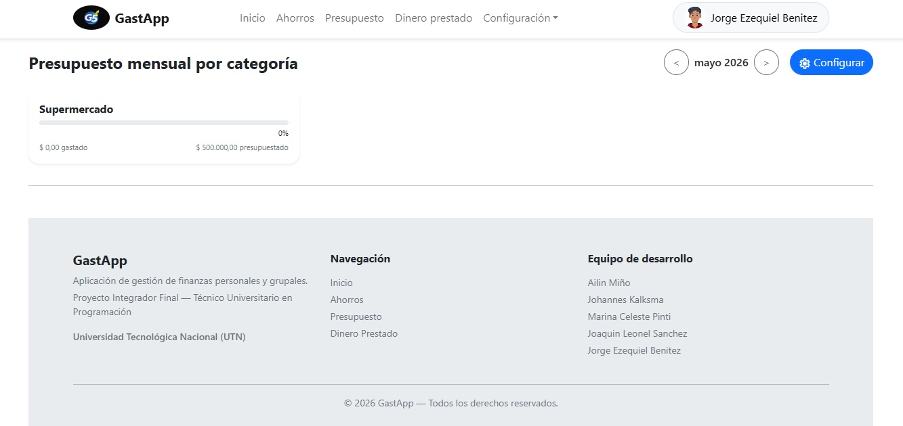

### Metas de ahorro

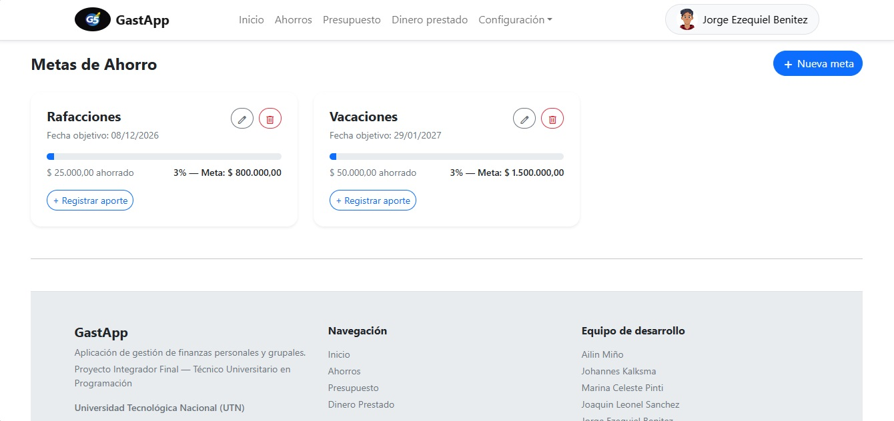

### Dinero prestado

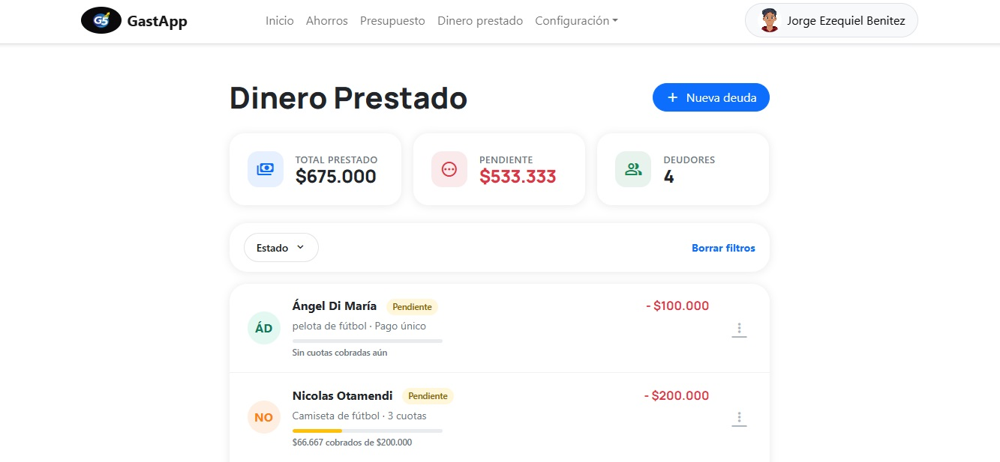

### Detalle de deuda con cuotas

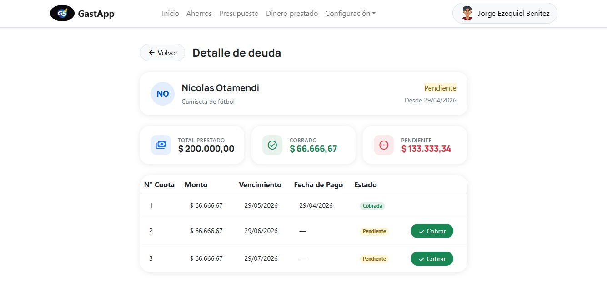

### Recuperación de contraseña por email

| Paso 1 — Solicitud | Paso 2 — Confirmación |
|--------------------|------------------------|
| 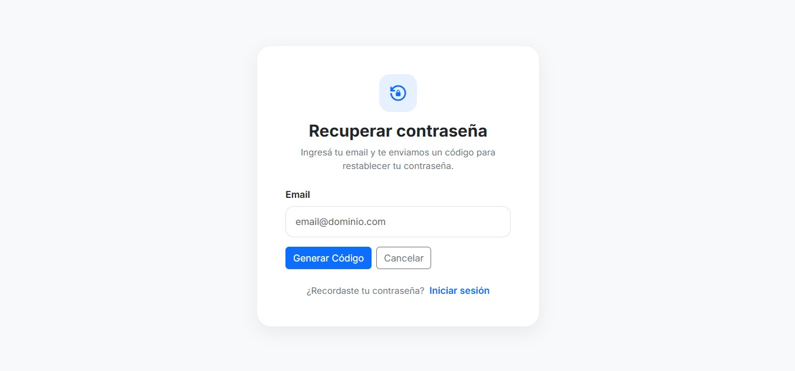 | 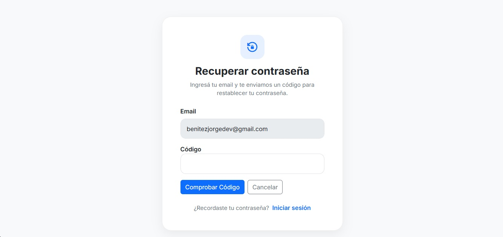 |

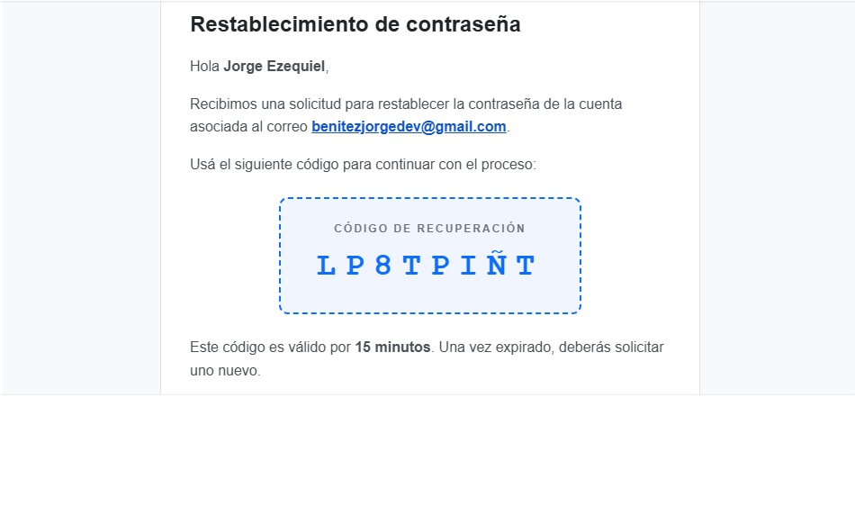

### Vista mobile

<div align="center">
  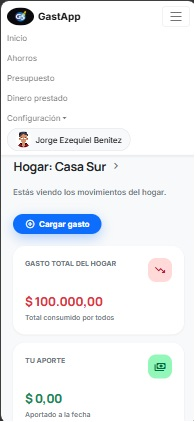
</div>

---

## Stack tecnológico

| Capa                  | Tecnología                                                  |
|-----------------------|-------------------------------------------------------------|
| Backend               | C# (.NET Framework 4.8)                                     |
| Capa Web              | ASP.NET Web Forms                                           |
| Frontend              | Bootstrap 5, jQuery 3.7                                     |
| Base de datos         | SQL Server                                                  |
| Generación de gráficos| Componentes web con datos serializados a JSON               |
| Servicios externos    | Servicio de email (recuperación de contraseña)              |
| Otros                 | Newtonsoft.Json, ASP.NET Friendly URLs, Helper de geolocalización |

---

## Arquitectura

Separación clásica en **3 capas**:

```
TPFinalIntegrador/        # Capa de Presentación (Web Forms .aspx)
negocio/                  # Capa de Lógica de Negocio + servicios (Email, Seguridad)
dominio/                  # Capa de Dominio (entidades del modelo)
```

Otros aspectos relevantes:

- **Soft delete** mediante campo `Estado` en entidades clave.
- **Master / Mobile Master** para soportar layouts diferenciados.
- **Versionado de scripts SQL** (la base llegó hasta la versión `v7.0`).

---

## Modelo de datos

El modelo de dominio cubre el ciclo completo de la administración financiera personal y grupal. Algunas de las entidades principales:

- **Usuario**, **Hogar**, **HogarUsuario** (con campo `Rol`)
- **Gasto**, **GastoCategoria**, **GastoPorIntegrante**, **Categoria**, **MedioPago**
- **Ingreso**, **Movimiento**
- **Deuda**, **Cuota**, **CuotaDeuda**
- **MetaAhorro**, **AporteMeta**
- **Presupuesto**, **PresupuestoCategoria**

---

## Instalación y puesta en marcha

### Requisitos previos
- Visual Studio 2019 o superior
- SQL Server (Express o superior)
- .NET Framework 4.8

### Pasos

1. **Clonar el repositorio**
   ```bash
   git clone https://github.com/benitex-dev/TPFinalIntegrador.git
   ```

2. **Restaurar la base de datos**
   - Ejecutar el script `Gestion_de_Gastos_BD_v7.0.sql` en SQL Server para crear la base.
   - Opcional: ejecutar `inserts_DB_TP_Final` para cargar datos de prueba.

3. **Configurar la cadena de conexión**
   - Editar el archivo de configuración (`Web.config`) y ajustar el `ConnectionString` a tu instancia de SQL Server.

4. **Configurar el servicio de email** (opcional, solo si querés probar el flujo de recuperación de contraseña)
   - Configurar las credenciales SMTP en `Web.config`.

5. **Abrir la solución**
   - Abrir `TPFinalIntegrador.sln` en Visual Studio.
   - Restaurar paquetes NuGet si fuese necesario.
   - Establecer `TPFinalIntegrador` como proyecto de inicio.
   - Compilar y ejecutar.

---

## Equipo

Proyecto desarrollado en equipo por:

- **Ailin Miño**
- **Johannes Kalksma**
- **Marina Celeste Pinti**
- **Joaquin Leonel Sanchez**
- **Jorge Ezequiel Benitez** — [@benitex-dev](https://github.com/benitex-dev)

---

## Acerca del proyecto académico

Este sistema fue desarrollado como **Proyecto Integrador Final** para la asignatura **Programación IV** de la Tecnicatura Universitaria en Programación de la **Universidad Tecnológica Nacional — Facultad Regional General Pacheco (UTN FRGP)**.

El objetivo fue aplicar conocimientos de **Programación Orientada a Objetos**, **Arquitectura por Capas**, **Bases de Datos Relacionales** y **Desarrollo Web con ASP.NET** en un sistema integral construido de punta a punta.
